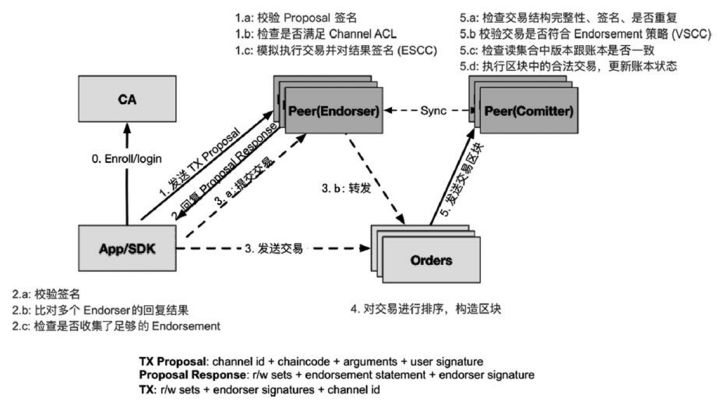
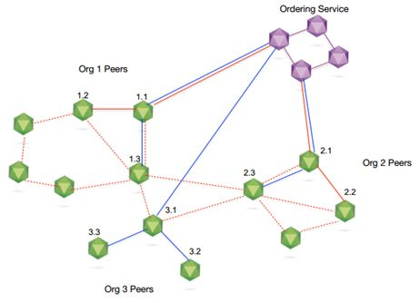
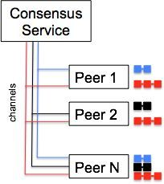

# 部署

序号 | 内容 | 更新人 | 更新日期 | 版本
---| --- | --- | --- | ---
1 | 文档初始化 | 许向 | 2019-2-26 | 0.1
2 | 添加内容 | 许向 | 2019-3-7 | 0.2

## 内容

- 单机测试环境部署
- 多机测试环境部署
- 生成环境部署

在部署前有几个点要理清楚

## 节点

1. Orderers:提供共识服务的网络节点，例如，使用Kafka或PBFT。
2. Peers:维护账本的网络节点，通常在Hyperledger Fabric中担任背书或者记账角色。
3. Comitter:检查交易的合法性，最终将交易提交到去区块链中。

三者关系

交易过程中

- 客户端（App）：客户端应用使用SDK来跟Fabric网络打交道。首先，客户端从CA获取合法的身份证书来加入网络内的应用通道。然后，将交易的提案发送给配置文件里指定的背书节点（Endorser节点）。
- Endorser节点：完成对交易提案的背书（目前主要是签名）处理。检查是否合法，通过则模拟运行交易，对交易导致的状态变化进行背书并返回结果给客户端。
- Orderer节点：仅负责排序。为网络中所有合法交易进行全局排序，并将一批排序后的交易组合生成区块结构。Orderer一般不需要跟账本和交易内容直接打交道。
- Committer节点：负责维护区块链和账本结构。该节点会定期地从Orderer获取排序后的批量交易区块结构，对这些交易进行落盘前的最终检查。检查通过后执行合法的交易，将结果写入账本，同时构造新的区块。
- CA：负责网络中所有证书的管理（分发、撤销等），实现标准的PKI（公共密钥基础）架构。

## 通道

上面只是在一个交易中，从节点的角度，来看交易的处理过程。然而，究竟有多少节点参与背书？多少节点来进行共识排序呢？在Fabric中，引入了通道的概念。

一般情况下，一条区块链网路的子链是按照“1个通道+ 1个账本+ N个成员 ”的基本组成。

通道是两个或多个特定网络成员之间的通信的私有“子网”，用于进行需要数据保密的交易。在Fabric中，建立一个通道相当于建立了一个个子链。

通道定义

创建通道是为了限制信息传播的范围，是和某一个账本关联的。每个交易都是和唯一的通道关联的。这会明确地定义哪些实体（组织及其成员）会关注这个交易。

- 通道：Order 服务提供Peer节点供订阅的主题，每个主题是一个通道。 peer可以在订阅多个通道，并且只能访问订阅通道上的交易。关于“订阅-发布主题”，在后面会详细介绍。
- 账本：账本保存Orders提交经节点确认的交易记录。
- 成员：访问和使用账本的网络节点。
- 链：基本上，一个链由1个通道+ 1个账本+ N个成员组成。非链的成员无法访问该链上的交易。链的成员可以由应用程序动态指定。

从关键词“1个通道+ 1个账本+ N个成员”可以知道，要在Fabric区块链网络中，搭建一个子链，需要创建通道，利用通道将成员加入进来，由N个成员维护一个账本，从而实现一个区块链。

## 拓扑关系

- 三条线，蓝色实线，红色实线，和橙色虚线，分别代表三个通道。
- 所有的通道，都连接了Ordering Service说明，共识服务接收所有链的所有交易。这一点，也说明了HyperLedger Fabric不是完全的去中心化，而是多中心化。
- peer1.1等节点，接入了多个通道，说明一个peer节点也可以参与到多个channel中。每个Channel之间是相互隔离，且是并行运行的。这一特性大大提高了系统的吞吐量。

从上图可以知道，一个链由1个通道+ 1个账本+ N个成员组成。共识是由Ordering Service提供的。应用程序指定Peer节点的子集中架设通道。 这些peer组成提交到该通道交易的相关者集合，而且只有这些peer可以接收包含相关交易的区块，与其他交易完全隔离。

## 多通道订阅

peer 1,2和N订阅红色通道，并共同维护红色账本; peer 1和N订阅蓝色通道并维护蓝色账本; 类似地，peer 2和peer N在黑色通道上并维护黑色账本。

在这个例子中，peer N在订阅了所有通道，我们看到每个通道都有一个相关的账本。 一般来说，我们称不涉及所有peer的账本为子账本，而涉及所有peer的账本另一种是系统账本，即全账本。

## 参考

[Fabric节点与Channel之间的关系](https://zhuanlan.zhihu.com/p/35349072)
